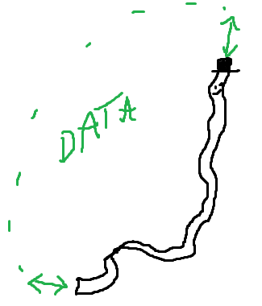

# @streamerson

> An API framework powered by distributed stream processing

<p align="center" justify="center">
  
</p>

:warning: **This project is in active development and is not yet trustable to be stable or work.  If you're interested in using it, hit me with a watch or star, and perhaps prod me toward publishing a 1.0.0 version.** :warning:

Welcome.  I hope you're a fan of Redis Streams, Event-Oriented Architecture, or just people recommending you books about the Observer Model (that you never end up reading despite your best intentions).  If not, turn back, because here there be dragons.

This monorepo is a collection of tools and instrumentation to make Redis streams fun & easy to confuse yourself with.  It's probably for you if you're interested in any of the following subjects:

- :heavy_check_mark: Low-latency Event Streaming
- :heavy_check_mark: Asynchronous Event-Oriented architecture
- :heavy_check_mark: Streaming nicely typed objects in realtime with Typescript
- :heavy_check_mark: Bidirectional Streams / Channels and Consumer-Producers
- :heavy_check_mark: Parallelization of stream consumers with Consumer Groups
- :heavy_check_mark: Remote Streams presented as a Node.JS `EventEmitter`
- :heavy_check_mark: Remote Streams presented as a Node.JS `Readable`/`Writable`
- :heavy_check_mark: Remote Streams presented as a Node.JS `AsyncIterable`
- :heavy_check_mark: Low-level control over "Stream" abstractions and partitioning
- :heavy_check_mark: Higher-level interfaces leveraging these low-level Streams

And lastly,

- :question: A Harebrained API Framework where all services are built atop event-oriented stream pipelines.

# Monorepo Package Links:

- [`@streamerson/core`](./packages/core/README.md): a collection of core low-level implementations and utilities
- [`@streamerson/consumer`](./packages/consumer/README.md): an event consumer/producer for Redis streams
- [`@streamerson/consumer-group`](./packages/consumer-group/README.md): kafkaesqe groups of consumer/producers with only-once delivery
- [`@streamerson/gateway-fastify`](./packages/gateway-fastify/README.md): a Fastify plugin shifting RESTful traffic to stream consumers
- [`@streamerson/gateway-wss`](./packages/gateway-wss/README.md): a Websocket server shifting WSS traffic to stream consumers
- [`@streamerson/state-machine`](./packages/state-machine/README.md) :warning: **WIP/Unfinished:** :warning: a distributed state(less)-machine made of a
  consumer group with a single writer and many readers operating on a shared, recoverable in-memory state. The idea is
  that it is easy to model state machines and transitions (and serve information about the current state) by aggregating
  a stream into a single application-layer that can recover & shard its state in Redis.  One could imagine this as a **Log-Structured Merge Tree for Application State**.
- [`@streamerson/examples`](./packages/examples/README.md): :star: examples :star: of the above in action


## Table of Contents:
<!-- START doctoc generated TOC please keep comment here to allow auto update -->
<!-- DON'T EDIT THIS SECTION, INSTEAD RE-RUN doctoc TO UPDATE -->

- [Installation](#installation)
- [Example:](#example)
  - [Foreword on Monorepo Packages](#foreword-on-monorepo-packages)
- [High Level Goals](#high-level-goals)
- [High Level Architecture](#high-level-architecture)
- [Why Streams?](#why-streams)
- [Message Flow](#message-flow)
- [Stream Message Protocol](#stream-message-protocol)
- [Stream Message Payloads](#stream-message-payloads)
- [Stream Sharding](#stream-sharding)
- [Data Loss, and A.C.I.D. Nonsense](#data-loss-and-acid-nonsense)
- [More Reading](#more-reading)
  - [License](#license)

<!-- END doctoc generated TOC please keep comment here to allow auto update -->

# Installation

- yarn: `yarn add @streamerson/core @streamerson/consumer`
- npm: `npm install @streamerson/core @streamerson/consumer`

# Example:

A thousand-foot view of some stuff you can do:

<!-- BEGIN-CODE: ./packages/examples/consumers/single-bidi/consumer-with-framework.example.ts -->
[**consumer-with-framework.example.ts**](./packages/examples/consumers/single-bidi/consumer-with-framework.example.ts)
```typescript
import { Topic } from '@streamerson/core';
import { StreamConsumer } from '@streamerson/consumer';

const consumer = new StreamConsumer({
    topic: new Topic('my-stream-topic'),
    bidirectional: true
});

consumer.registerStreamEvent<{ name: string }>('hello', async (e) => {
   return {
       howdy: `there, ${e.payload.name}`
   }
});

await consumer.connectAndListen();
```
<!-- END-CODE: ./packages/examples/consumers/single-bidi/consumer-with-framework.example.ts -->

In the above example, we listen for events and write down the bidirectional channel when we process one.  This is a primitive unit-- with more similar units you could build event-oriented applications using the high-level modules.  For more examples, please check the dedicated monorepo entry [`@streamerson/examples`](./packages/examples/README.md).  There are examples of the low-level pieces from which the high-level module are assembled.  However, if you are interested in the higher-level API framework picture, some use-case examples are laid out here:
- [A Hello World App](./packages/examples/app-hello-world/README.md)
- [A Typical CRUD App](./packages/examples/app-basic-crud/README.md)
- [A Websocket<->Stream Adapter](./packages/examples/app-websockets/README.md)
- & more, with more to come

## Foreword on Monorepo Packages

- [The core SDK `@streamerson/core`](./packages/core/README.md) contains utilities to wrap a Redis client with a layer that is capable of accessing Redis streams in a couple Node-idiomatic ways, such as:
  - :heavy_check_mark: Promise batch retrieval of **typed** stream messages
  - :heavy_check_mark: Async Iterators for Redis streams
  - :heavy_check_mark: EventEmitters for Redis Streams
  - :heavy_check_mark: Escape hatches for using your own Redis client
  - [More Documentation Available](./packages/core/README.md#api)
- [The Consumer/Producer API `@streamerson/consumer`](./packages/consumer/README.md) is a set of utilities to abstract the raw streams from the `@streamerson/core` module and consume them as event-handling structures not much unlike a webserver.
  - :heavy_check_mark: Supports a declarative way to consume `@streamerson` streams and bind events to message types
  - :heavy_check_mark: Supports bidirectional streaming patterns for consumer/producers to write to other stream(s) given an input from the first
  - :heavy_check_mark: Provides extensible pattern for modeling consumer flows
- [The Consumer Group API `@streamerson/consumer-group`](./packages/consumer-group/README.md) extends the `@streamerson/consumer` API to provide consumer-group functionality, which allows a set of consumers to operate atomically on a single stream with messages promised to be delivered to a single of the multi-consumers.  This pattern (implemented in Redis but consumed by these modules) allows for parallelizing the workers on a stream without duplicating the messages received between any listeners.
  - :heavy_check_mark: Implements the Redis Consumer Group API for horizontal scaling of a single stream
  - :heavy_check_mark: Allows for recovery on crash of a given consumer within a group
- [Examples `@streamerson/examples`](./packages/examples/README.md) for examples of the code, and the underlying modules, in action.

If you are interested in the components of the monorepo I encourage you to look at the individual package `README.md` files (I've provided [links above](#monorepo-package-links), or you can just peruse the repository `/packages` directory, though some of those are strictly internal).

If you are interested in _**why**_ I've made these things, read on.

# High Level Goals

If you aren't interested in reading about my harebrained API framework concept, then you might be here to poke around the [monorepo packages](#foreword-on-monorepo-packages) (which are pretty much framework-agnostic).   The motivations for this project were my attempt to implement a pattern I probably didn't invent, but
will here claim. It is an API pattern/framework meant to simplify many of the
problems I see in modern microservice architecture. Roughly, it is meant to
achieve the following:

- **Separate REST** "handlers" from the code that they execute ("endpoints")
- **Stream all data** between backend services, never make HTTP/s calls
- Enable **per-"endpoint" scaling** decisions (without code churn)
- Allow for a **polyglot backend** without polyglot API frameworks
- **Reduce infrastructural complexity** by flattening data flow

# High Level Architecture

Three simple premises drive the architecture of the Streamerson pattern:


- A load-balanced, stateless REST API listens to all user traffic. Think of it
  as a gateway. It is normal, except extended with one new feature: the ability
  to connect to a source of streaming data, and when users make requests, it
  simply writes to the appropriate stream for that message. After doing so, it
  waits for a response message from the streaming data source that is specific
  to the originating request.

- One or more streaming data sources provide bidirectional streams to the API
  layer and a worker layer. In all examples in this documentation, you are to
  read this data source as being Redis Streams, but you could imagine them being
  any platform meant for streaming (Kafka, Kinesis, SQS, etc).

- A worker layer: any pool of compute reading from streams and maybe responding.
  This could be thought of as a bunch of worker threads, each apportioned to
  some stream (or set of streams), reading in the payloads of requests and
  executing some business logic. It maybe writes a response message to the
  appropriate stream.

That's it-- at a high level, this is the architecture I propose. My
implementation is just a set of stitched-together libs and wrappers, meant to
abstract away all the streaming logic and simply provide an interface to wrangle
these streams without worrying about the complexity.

Of course, in reality, the diagram for the system architecture might leave out quite a bit but actually look closer to this:


But again, this package is meant to hide that complexity behind a few nice Typescript interfaces and conventions.

# Why Streams?

My argument is that it's advantageous to terminate all HTTPs at the user-boundary, and use Redis Streams as the communication channel for the interior services.  This pattern (sans Redis) isn't to my knowledge new (you'll see the GRPC folks doing similar things), but I've [documented my thoughts on this particular question here](./docs/WHY_STREAMS.md).

# Message Flow


The messages from the API are translated into a [protocol](#stream-message-protocol) that encodes metadata about the request into the stream message.  The listeners on that stream decode the request, trigger an event, and optionally reply to the event with a response message.  The API layer is already listening for that response message against a requested stream, and when it gets it, translates it back to a REST response that the user transparently receives.

This flow is very similar in the [websocket](./packages/gateway-wss/README.md) implementation, except that the API is translating to-and-from WebSockets rather than HTTP, and transactional operations are not supported (i.e., no message has a response, although a message may trigger the side effect of later messages).

# Stream Message Protocol

The requisite protocol of `@streamerson` is defined as an ordered array of the following values:

<!-- BEGIN-CODE: ./docs/PROTOCOL.md -->
[**PROTOCOL.md**](./docs/PROTOCOL.md)

| Field           | type             | Meaning                                                  |
|-----------------|------------------|----------------------------------------------------------|
| streamId        | string           | the name of a Redis stream                               |
| messageType     | string           | the event type                                           |
| streamHeaders   | JSON string      | a map of header values for routing                       |
| messageProtocol | `text` or `json` | some encoding (maybe future support for BSON/GRPC _etc_) |
| sourceId        | GUUID            | the source of the message                                |
| UnoccupiedField | nil              | [currently unused]                                       |
| payload         | `text` or `JSON` | the message payload                                      |

<!-- END-CODE: ./docs/PROTOCOL.md -->

The reason for this shape is that Redis essentially encodes the fields of a stream-message as the following:

```typescript
type RawRedisMessageTuple = [
    streamId: string, 
    messages: [
        messageId: string, 
        message: [
          k: string, 
          v: string
        ]
    ]
]
```

In, order to avoid behavior where we search through the keys of a message to marshall it into a `MappedStreamEvent`, we define a common/required ordering of the keys (`k`) and values (`v`).  In fact,  I've taken some liberties and jammed values into both the key and value components of the messages, to compress the size of a single message by defining a strict protocol by which all messages are sent.  This protocol could be thought of as a piece of code which does the following:

```typescript
// redisResponse[1] assumes a single requested stream:
const [ streamId, messages ] = redisResponse;

for (const message in messages) {
  const cursor = message[0]; // a timestamp, usually
  const [
    messageId,
    type,
    headers,
    protocol,
    source,
    _,
    payload
  ] = message[1]; // the key-values
}
```
Because redis doesn't care much about the size of keys versus the size of values, I am essentially setting key-value pairs to value-value pairs.  This might have some negative repercussions in Redis but if definitions reveal that, I'll change it.  For now, it achieves a roughly halving of the field-count for a given message.

# Stream Message Payloads

The `payload` field of a stream is a text object with an encoded content according to the `messageProtocol` of its stream message.  This means that for a `messageProtocol: 'json'`, the expected shape of the `payload` should be the valid input to a call of `JSON.stringify`.  This allows support for atypical protocols; in the future, it's likely that a `binary` payload option-- in fact, the current Typescript allows for a `Buffer` in this field though the use-case is not fully supported.

Extending the protocol to support additional fields and/or additional varieties of content (like messageProtocols) is relatively easy, so please open an issue if I've forgotten something useful.  For now, all intended applications are using `JSON` encoded text.

# Stream Sharding

In Redis streams can be easily logically partitioned with no need for declarations; simply adding a string to the key of a stream will create a logically different stream.

For that reason, `shard: string` exists as a parameter on many runtime functions.  Right now this use-case is not entirely supported or built-out, but is intended for cases like the following:
- Tenancy: logically separate tenants into their own streams
- Versioning: support versioned APIs on their own streams
- Partitioning: partition one stream into many, for reasons
- _etc._

# Data Loss, and A.C.I.D. Nonsense

The `@streamerson` pattern is using Redis for traffic that would be normally considered "in-flight" and thus not really subject to questions about ACID compliance.  It isn't a database, although the `state-machine` package is a caveat to this paragraph because it does support eventually-consistent data patterns and is thus explicitly non-ACID compliant. 

- In Redis failure scenarios, the front-end will *not* lose a connection to the HTTP server.  It is possible to implement redundancy such that a secondary (or n-ary) instance is used, and as long as processors are connected to those instances, traffic will still seamlessly flow.
- There is no advantage to "sticky Redis instances" in the typical Streamerson [architecture](#high-level-architecture), so switching to a different instance is generally non-problematic aside from an initial delay if an instance fails. 
- This means that no messages will be lost if Redis fails but the request may take longer to process.  It may result in timeouts, depending on various client and server configurations.

# More Reading

 - [The monorepo packages of interest](#monorepo-package-links)
 - [A parable about a semi-fictional microservice scaling problem](./docs/PARABLE.md)

## License

This project is licensed with the [LAMC (Love All My Cats)](./LICENSE.md) license. It is to be taken very seriously, but permits pretty
much unrestricted usage of this code.

If you use Streamerson, or are inspired by it, please drop me a star, comment, issue, PR, email, or well-wish.
